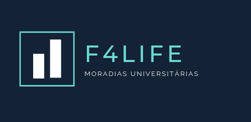

  

# **Projeto Landing Page**

## Descrição
Criar uma versão inicial simplificada de um website, uma Landing Page. 
A empresa fictícia F4Life foi criada e é uma empresa de aluguéis de quartos para pessoas universitárias. A empresa realiza reformas e prepara moradias para recepção de estudantes em um ambiente específico e otimizado para a vida de graduação. 

## Funcionalidades
* Responsividade a versão mobile e versão desktop.
* Tags semanticas do HTML5.
* Links com ícone para as redes sociais.
* CSS indica que parte do layout as regras se referem.
* Informações: 'Quem somos', 'Serviços', 'Contato', 'Onde estamos'.

## Tecnologias utilizadas
* HTML
* CSS

## Colaboradores
* Wesliane Silva Vieira => <https://github.com/weslianevieira>
* Gilead Raab => <https://github.com/gileadraab>

## Status do projeto
* Concluído.

[F4 LIFE: Moradias Universitárias](https://chilly-rest.surge.sh)

